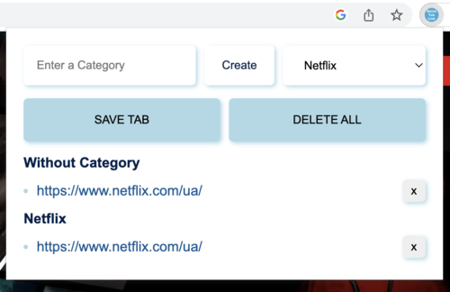

# **QuickTabLink**

## **Overview**

QuickTabLink is a simple Google Chrome extension that allows you to quickly grab the URL of the current tab and save it for later use. Simply click the extension icon in your browser, and the link will be saved to your browser's storage. No more copying and pasting, or losing track of important links.

## **Features**

- Create categories and save links on it
- Remove all links and categories
- Don't save the same link in one category
- Remove links from categories when they're no longer needed
- Save everything in the LocalStorage

## **Tech Used**

-	HTML
-	CSS
-	JS

## **Screenshot**

 

## **Youtube video**

